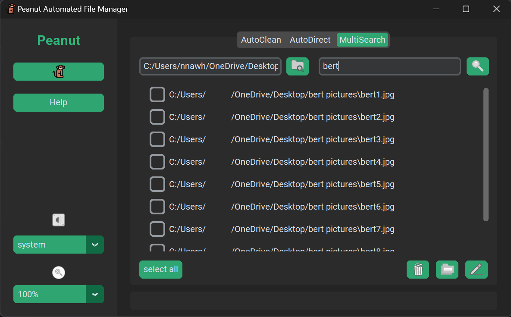

# Peanut Automated File Manager  
Say hello to Peanut, your friendly file-managing squirrel monkey! Peanut is here to simplify your life by helping you clean, organize, and manage your files effortlessly. Whether you're tackling cluttered folders or searching for specific files, he's got your back!

## Features 
### AutoClean 
Automatically clean up your system by: 
* Selecting how frequently you'd like your system cleaned
* Deleting empty folders
* Removing unused files
* Eliminating duplicate files
* Cleaning out your recycling bin
* Clearing your browser history 
### AutoDirect
Organize your files by setting up customizable rules based on keywords. 
### MultiSearch 
Search, rename, convert file formats, and perform multiple operations — all in one place. 
### User Preferences
Peanut remembers your settings and preferences. 

## Tech Stack 
* **Frontend:** Python Tkinter
* **Backend:** Python, SQLite

## [Watch Demo](https://youtu.be/QnRgXUTsZNY)

<a href="https://youtu.be/QnRgXUTsZNY">
  
</a>

## Setup
1. Clone the Repository
   ```
   https://github.com/KatavinaNguyen/peanut-python-automated-file-manager.git
   ```
2. Install Dependencies
   ```
   pip install -r requirements.txt
   ```
3. Run
   ```
   python main.py
   ```

## How to Use
Open Peanut and start by setting up your preferences on the sidebar. 
> [!TIP]
> The **Help** menu has more in-depth information with FAQs.

Navigate the 3 tabs at the top of the **Main Screen**. 
+ Use the **AutoClean** feature to sweep away unnecessary files.
+ Set up **AutoDirect** rules to keep your files organized automatically. 
+ Try out **MultiSearch** for complex file operations.<br><br>

 
 
